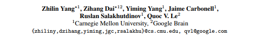

**XLNet: Generalized Autoregressive Pretraining for Language Understanding 论文的中文翻译**

本文是XLNet论文的全文翻译，转载注明出处和译者。

+ 原文 [XLNet: Generalized Autoregressive Pretraining for Language Understanding](https://arxiv.org/abs/1906.08237)
+ [XLNet翻译 PDF版](XLNet翻译.pdf) 或 [在线阅读](https://yuanxiaosc.github.io/2019/07/03/XLNet_Generalized_Autoregressive_Pretraining_for_Language_Understanding%E7%BF%BB%E8%AF%91/)
+ 译者：袁宵
+ 说明：1. 对于没有标准译法的词语保留了原单词；2. 以准确翻译为第一目标，力求保持原意；3. 欢迎读者参与到翻译中来，提出修改意见。
+ 欢迎点亮右上角星星，感谢 :smiley:

手机扫码阅读：

---

**由于GitHub目前不能很好渲染公式符号，建议直接查看[PDF版翻译](XLNet翻译.pdf) 或 [在线阅读](https://yuanxiaosc.github.io/2019/07/03/XLNet_Generalized_Autoregressive_Pretraining_for_Language_Understanding%E7%BF%BB%E8%AF%91/)**

# XLNet：广义自回归预训练语言模型

## 摘要

由于具有双向上下文建模的能力，像BERT这样基于自动去噪的预训练语言模型比基于自回归的预训练语言模型的性能更好。然而，依赖于使用带掩码（masks）损坏的输入，BERT忽略了掩码位置之间的依赖性，由此受到了预训练-微调阶段不一致的影响。针对这些优点和缺点，我们提出了XLNet，一种广义自回归预训练方法，它（1）通过最大化输入序列的因式分解的所有排列的似然函数的期望来学习双向上下文，并且（2）并且通过其自回归方法，克服了BERT的局限性。此外，XLNet将最先进的自回归模型Transformer-XL的思想整合到预训练中。实验表明，XLNet在20个任务上常大幅度优于BERT的表现，并在18个任务中实现最先进的结果，包括问答、自然语言推理、情感分析和文档排名（注1：预训练的模型和代码可在 https://github.com/zihangdai/xlnet 获得）。

---

## XLNet 相关资源

推荐阅读 [XLNet Generalized Autoregressive Pretraining for Language Understanding](https://yuanxiaosc.github.io/2019/07/03/XLNet_Generalized_Autoregressive_Pretraining_for_Language_Understanding/)
