本文是XLNet论文的全文翻译，转载注明出处和译者。

+ 原文 [XLNet: Generalized Autoregressive Pretraining for Language Understanding](https://arxiv.org/abs/1906.08237)
+ PDF版翻译以及相关资源链接 GitHub [XLNet_Paper_Chinese_Translation](https://github.com/yuanxiaosc/XLNet_Paper_Chinese_Translation)
+ 译者：袁宵
+ 说明：1. 对于没有标准译法的词语保留了原单词；2. 以准确翻译为第一目标，力求保持原意；3. 欢迎读者参与到翻译中来，提出修改意见。

---

手机扫码阅读：

---

# XLNet：用于语言理解的广义自回归预训练模型

## 摘要

由于具有双向上下文建模的能力，像BERT这样基于自动去噪的预训练语言模型比基于自回归的预训练语言模型的性能更好。然而，依赖于使用带掩码（masks）损坏的输入，BERT忽略了掩码位置之间的依赖性，由此受到了预训练-微调阶段不一致的影响。针对这些优点和缺点，我们提出了XLNet，一种广义自回归预训练方法，它（1）通过最大化输入序列的因式分解的所有排列的似然函数的期望来学习双向上下文，并且（2）并且通过其自回归方法，克服了BERT的局限性。此外，XLNet将最先进的自回归模型Transformer-XL的思想整合到预训练中。实验表明，XLNet在20个任务上常大幅度优于BERT的表现，并在18个任务中实现最先进的结果，包括问答、自然语言推理、情感分析和文档排名（注1：预训练的模型和代码可在 https://github.com/zihangdai/xlnet 获得）。

## 1 介绍

无监督表示学习在自然语言处理领域非常成功[7,19,24,25,10]。通常，这些方法首先在大规模的未标记文本语料库上预训练神经网络，然后在下游任务中微调模型或对模型输出的表示进行优化。在上述这种共同的指导思想下，文献中探索了不同的无监督预训练目标。其中，自回归autoregressive（AR）和自编码autoencoding（AE）语言模型是两个最成功的预训练目标。

AR语言模型试图用自回归模型估计文本语料库的概率分布[7,24,25]。具体而言，给定文本序列 $\textbf{x}=(x_1,...,x_T)$，AR语言模型将似然函数因式分解为一个向前的乘积 $p(\textbf{x})=\prod_{t=1}^Tp(x_t|\textbf{x}_{<t})$ 或者一个向后的乘积 $p(\textbf{x})=\prod_{t=T}^1p(x_t|\textbf{x}_{>t})$ 。训练参数模型（例如，神经网络）来拟合每个条件概率分布。由于AR语言模型仅经过训练来编码单方向内容（向前或向后），因此无法有效建模深度双向上下文。然而，下游语言理解任务通常需要双向上下文信息。这导致AR语言建模与有效预训练之间存在差距。

相比之下，基于AE的预训练模型不执行显式密度估计，而是旨在从损坏的输入重建原始数据。一个值得注意的例子是BERT[10]，它是最先进的预训练方法。给定输入tokens序列，tokens的某一部分被特殊符号[MASK]替换，并且训练该模型来从损坏的版本输入序列中恢复原始tokens。由于密度估计不是训练目标的一部分，因此允许BERT利用双向上下文来重建原始输入。作为一个直接的好处，这将弥补前面提到的AR语言建模与有效预训练之间存在差距，从而提高了性能。 然而，在训练期间，BERT在预训练时使用的[MASK]等人造符号在实际数据中不存在，从而导致预训练-微调的不一致。 此外，由于预测的tokens在输入中被遮蔽，因此BERT不能像在AR语言模型中那样使用乘积规则来建模联合概率。换言之，BERT假设要预测的tokens在给定未遮蔽的tokens的条件下彼此独立，由于自然语言高度有序且长距离依赖广泛存在于自然语言中，因此该假设简化过度了[9]。

面对现有预训练语言模型目标的优缺点，在本工作中，我们提出了XLNet，这是一种广义的自回归方法，它充分利用了AR和AE语言模型的优点，同时避免了它们的局限性。
+ 第一，不是像传统的AR模型那样使用固定的前向或后向序列因式分解顺序，XLNet最大化**有关序列所有可能的因式分解的排列**的对数似然函数的期望。由于排列操作，每个位置的上下文可以包括来自左侧和右侧的tokens。可以预计，每个位置都要学会利用来自所有位置的上下文信息，即捕获双向上下文。
+ 第二，作为一种通用的AR语言模型，XLNet不依赖于数据损坏。因此，XLNet不会遭受BERT中存在的预训练-微调差异的影响。同时，自回归目标还提供了一种自然的方式来使用乘积规则来分解预测的tokens的联合概率，从而消除了在BERT中做出的独立性假设。

除了新的预训练目标外，XLNet还改进了预训练的模型结构设计。
+ 受到AR语言模型的最新进展的启发，XLNet集成了分段循环机制（segment
recurrence mechanism）和相关的Transformer-XL编码模式到预训练中，这在实验中改善了性能，特别是对于涉及较长文本序列的任务。
+ 直接地将Transformer（-XL）结构应用于基于排列的语言模型不起作用，因为分解顺序是任意的并且目标是不明确的。为了解决这个问题，我们提出重新参数化Transformer（-XL）网络来消除歧义。

实验中，XLNet在18个任务上实现了最先进的结果，即7个GLUE语言理解任务，3个阅读理解任务，包括SQUAD和RACE，7个文本分类任务，包括Yelp和IMDB，以及ClueWeb09-B文档排名任务。在一系列公平的比较实验中，XLNet在多个基准测试中始终优于BERT[10]。

**相关工作** 在[32,11]中已经探讨了基于排列的AR建模的想法，但是存在几个关键的差异。以前的模型是无序的，而XLNet本质上在位置编码上顺序敏感的。 这对于语言理解很重要，因为无序模型退化为次袋模型，缺乏基本的表达能力。上述差异源于动机的根本不同——之前的模型旨在通过在模型中加入“无序”归纳偏置来改进密度估计，而XLNet的动机是让AR语言模型来学习双向上下文。

## 2 提出的方法

### 2.1 背景

在本节中，我们首先回顾并比较传统的AR语言模型和BERT语言模型的预训练过程。给定一个文本序列 $\textbf{x}=[x_1,...,x_T]$，AR语言模型通过最大化前向自回归因式分解的似然函数来进行预训练：

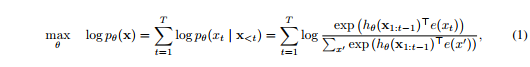

其中$h_{\theta}(\textbf{x}_{1:t-1})$是一个由神经模型产生的上下文表示，例如RNNs或者Transformers，$e(x)$表示$x$的嵌入。相比之下，BERT基于去噪自动编码（denoising auto-encodin）。具体地说，对于文本序列$\textbf{x}$，BERT首先通过将$\textbf{x}$中的一部分（例如15％）tokens随机设置为特殊符号[MASK]来构造损坏版本$\hat \textbf{x}$。用$\overline \textbf{x}$表示遮蔽的tokens。训练目标是从$\hat \textbf{x}$中重建$\overline \textbf{x}$：

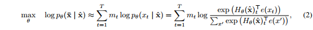

其中$m_t=1$表示$x_t$被遮蔽了，$H_{\theta}$是一个Transformer，它把一个长度为$T$的文本序列映射为一个隐藏向量序列$H_{\theta}=[H_{\theta}(x)_1,H_{\theta}(x)_2,...,H_{\theta}(x)_T]$。两个预训练目标的优缺点在以下几个方面进行了比较：
+ **独立性假设**：正如公式（2）$\approx$ 符号后所强调的那样，BERT基于所有被遮蔽tokens $\overline \textbf{x}$的独立性假设单独重建每一个被遮蔽token，来对联合条件概率$p(\overline \textbf{x}|\hat \textbf{x})$进行因式分解。相比之下，AR语言模型目标（1）在没有这种独立性假设的情况下使用一般的乘积规则进行因式分解。
+ **输入噪音**：BERT的输入包含[MASK]等人造符号，这些符号从未出现在下游任务中，从而产生预训练-微调差异。在[10]中用原始tokens替换[MASK]的方法并不能解决问题，因为原始tokens只能以很小的概率使用——否则公式（2）将是微不足道的优化。相比之下，AR语言模型不依赖于任何输入损坏，也不会遇到此问题。
+ **上下文依赖**：AR表示$h_{\theta}(\textbf{x}_{1:t-1})$仅以到tokens $t$前一个位置为条件（即，左边的tokens），而BERT表示$H_\theta(\textbf{x})_t$可以访问两侧的上下文信息。 因此，BERT目标允许预训练模型以更好地捕获双向上下文。

### 2.2 目标：排列语言模型（Permutation Language Modeling）

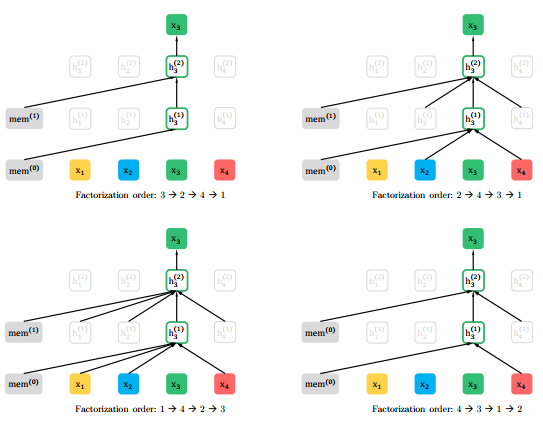
> 图 1：给定同一个输入序列$\textbf{x}$但是不同的因式分解顺序的情况下，排序语言模型预测目标是$x_3$的图解。

根据上面的比较，AR语言模型和BERT都具有独特的优势。 一个自然要问的问题是，是否存在一个预训练目标，即在避免其两者弱点的同时具有两者的优势。

借鉴来自无序NADE [32]的思想，我们提出了排列语言模型的目标，它不仅保留了AR模型的优点，而且还允许模型捕获双向上下文。具体来说，对于长度为$T$的序列$\textbf{x}$，有$T!$种不同顺序去执行一个有效的自回归因式分解。直觉上，如果模型参数在所有因式分解顺序中共享，可以预计，模型将学会从双方向的所有位置收集信息。

为了形式化这个思想，用$Z_T$表示长度为$T$索引序列的所有可能排序的集合。我们使用$z_t$和$\textbf{z}_{<t}$分别表示索引排序的第$t$个元素和前$t-1$个元素，$\textbf{z} \in Z_T$。然后，我们提出的排列语言模型目标函数可以表示如下：

本质上，对于文本序列$\textbf{x}$，我们对因式分解顺序$\textbf{z}$进行一次采样，并根据因式分解顺序分解似然函数$p_\theta(\textbf{x})$。 由于在训练期间在所有因子分解顺序中共享相同的模型参数$\theta$，可以预计，$x_t$已经看到序列中的每个可能元素$x_i \neq x_t$，因此能够捕获双向上下文。 此外，由于这个预训练目标满足AR框架，它自然地避免了2.1节中讨论的独立性假设以及预训练-微调不一致问题。

**关于排列的备注** 提出的预训练目标只会排列因式分解索引的顺序，而不会改变输入序列的顺序。换句话说，我们保持原始序列顺序，使用对应于原始序列的位置编码，并依赖Transformer中的适当注意掩码来实现因式分解索引顺序的排列。 请注意，此选择是必要的，因为模型在微调期间只会遇到具有自然顺序的文本序列。

为了提供一个完整的视角，在图1中，我们举了一个在给定同一个输入序列$\textbf{x}$但是不同的因式分解顺序情况下预测token $x_3$的例子。

### 2.3 结构：用于目标敏感表示（Target-Aware  Representations）的双流自注意力（Two-Stream Self-Attention）

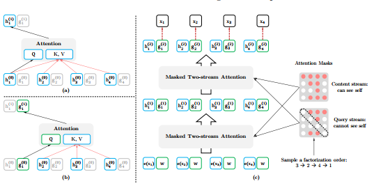
> 图2：（a）：内容流注意力（Content stream attention），这与标准的自注意力（self-attention）是一样的。（b）：查询流注意力（Query stream attention），它没有关于内容$x_{z_t}$的访问信息。（c）：具有双流注意的排序语言模型的训练概述。

虽然排序语言模型目标具有所需的属性，但使用标准的Transformer参数设定可能不起作用。看看问题所在，假设我们使用标准的Softmax公式参数化下一个token的分布$p_{\theta}(X_{z_t}|\textbf{x}_{\textbf{z}<t})$，即，$p_{\theta}(X_{z_t}=x|\textbf{x}_{\textbf{z}<t})=\dfrac{\exp(e(x)^Th_{\theta}(\textbf{x}_{\textbf{z}<t})}{\sum_{x'}\exp(\exp(e(x')^Th_{\theta}(\textbf{x}_{\textbf{z}<t})}$，其中$h_{\theta}(\textbf{x}_{\textbf{z}<t})$代表$\textbf{x}_{\textbf{z}<t}$经过共享的Transformer神经网络在适当遮蔽后产生的隐藏表示。现在注意到隐藏表示$h_{\theta}(\textbf{x}_{\textbf{z}<t})$与它将要预测的位置无关，也就是$z_t$的值。因此同样的分布用来预测而不管预测的位置，这将不能学到有用的表示（具体示例见附录A.1）。为了避免这个问题，我们提出重新参数化下一个token分布，以实现对目标位置敏感：

其中$g_{\theta}(x_{\textbf{z}<t, z_t})$代表一种新类型的表示，它把目标位置$z_t$作为输入添加进去。

**双流自注意力** 虽然目标敏感表示的想法消除了目标预测中的模糊性，但是如何形式化$g_{\theta}(x_{\textbf{z}<t, z_t})$仍然是一个棘手的问题。在多种可能的方法中，我们提出“站在”目标位置$z_t$并且依靠这个位置$z_t$通过注意力来收集上下文$x_{\textbf{z}<t}$的信息。要使此参数化起作用，在标准Transformer体系结构中存在两个相互矛盾的要求：（1）预测token $x_z, g_{\theta}(x_{\textbf{z}<t, z_t})$应该只使用位置$z_t$而不使用内容$x_{z_t}$，否则目标变得无效；（2）预测其它tokens $x_{z_j}$ 当$j>t, g_{\theta}(x_{\textbf{z}<t, z_t})$ 时应该编码$x_{z_t}$的内容以便获取所有的上下文信息。为了解决这种矛盾，我们提出使用两组隐藏的表示而不是一组：
+ 内容表示$h_{\theta}(\textbf{x}_{\textbf{z} \leq t})$，或者缩写为$h_{z_t}$，其作用与Transformer中的标准隐藏状态类似。这个表示编码上下文和$x_{zt}$本身。
+ 查询表示$g_{\theta}(\textbf{x}_{\textbf{\textbf{z}}<t, z_t})$，或者简写为$g_{z_t}$，其只能获取上下文信息$x_{\textbf{\textbf{z}}<t}$和位置$z_t$，但是不能获取$x_{z_t}$的内容，如上面的讨论。

计算上，第一层查询流用可训练向量初始化，也就是$g_i^{(0)}=w$，而内容流设置为相应的词嵌入，也就是$h_i^{(0)}=e(x_i)$。对于自注意力的每一层$m=1,...,M$，双流表示用一组共享的参数“示意性”（注2：“示意性”：为了避免混乱，我们省略了实现细节，包括多头注意、残差连接、层正则化、和Transformer（-XL）中使用的位置前馈层。 详情在附录A.2中，以供参考。）地更新如下（如图2（a）和（b）所示）：

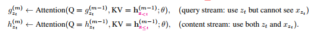

其中$Q,K,V$分别表示注意力操作中的查询query、键key和值value。内容表示的更新规则与标准自注意力完全相同，因此在微调时，我们可以简单地删除查询流并将内容流用作普通的Transformer（-XL）。最后，我们可以使用最后层查询表示$g_{z_t}^{(M)}$来计算公式（4）。

**局部预测**  虽然排序语言模型目标（3）具有几个优点，但由于排序和因此导致的在实验初期收敛缓慢，因此它有更具挑战性的优化问题。为了减少优化难度，我们选择仅预测在因式分解顺序最后的tokens。形式化，我们将$\textbf{z}$分解为非目标子序列$\textbf{z}_{\leq c}$和目标子序列$\textbf{z}_{>c}$，其中$c$是切割点。目标是最大化目标子序列在非目标子序列条件下的对数似然函数，即：

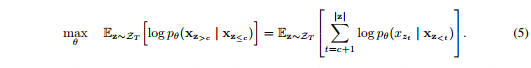

注意，选择$\textbf{z}_{>c}$作为目标，因为它在给定当前因式分解顺序$z$的序列中具有最长的上下文。使用超参数$K$，使得选择约$1 / K$ tokens用于预测; 即，$|\textbf{z}| / (|\textbf{z}| - c) \approx K$。对于未选择的tokens，不需要计算它们的查询表示，这样可以节省速度和内存。

### 2.4 融合Transformer-XL的想法

由于我们的目函数隶属于AR框架，因此我们将最新的AR语言模型Transformer-XL [9]整合到我们的预训练框架中，并在此基础上命名我们的方法。我们在Transformer-XL中集成了两项重要技术，即相对位置编码方案（relative positional encoding scheme）和分段循环机制（segment recurrence mechanism）。 如前所述，我们基于原始序列应用相对位置编码，这很直观。 现在，我们讨论如何将循环机制集成到本文提出的排列设置中，并使模型能够重用先前段中的隐藏状态。在不失一般性的前提下，假设我们有两个取自长序列$s$的片段； 即$\widetilde \textbf{x} = s_{1:T}$ 和 $\textbf{x} = s_{T+1:2T}$。让$\widetilde \textbf{z}$ 和 $\textbf{z}$ 分别表示 $[1...T]$ 和 $[T+1...2T]$ 的排列。然后，基于排列$\widetilde \textbf{z}$，我们处理第一段，然后为每个层$m$缓存生成的内容表示$\widetilde h^{(m)}$。然后，对于下一段$\textbf{x}$，记忆的注意力更新可以写为：

其中 $[...]$ 表示沿着序列维度串联。请注意，位置编码仅取决于原始序列中的实际位置。 因此，一旦获得表示$\widetilde h^{(m)}$，则上述注意更新与$\widetilde \textbf{z}$无关。 这允许缓存和重用内存，而无需知道前一段的因式分解顺序。 如预期的那样，该模型学会了在最后一段的所有因式分解顺序上利用内存。 可以以相同的方式计算查询流。 最后，图2（c）概述了带双流注意力机制的排列语言模型（有关更多详细说明，请参见附录A.4）。

### 2.5 建模多段（Modeling Multiple Segments）

许多下游任务具有多个输入段，例如，在问答任务中有一个问题和一个上下文段落。 现在，我们讨论预训练XLNet如何在自回归框架中对多个段进行建模。 如BERT那样，在预训练阶段期间，我们随机采样两个片段（无论是否来自同一上下文），并将两个片段的串联视为一个序列进而训练排列语言模型。 我们仅重用属于相同上下文的内存。 具体来说，我们模型的输入类似于BERT：[A，SEP，B，SEP，CLS]，其中“ SEP”和“ CLS”是两个特殊符号，“ A”和“ B”是这两个段。 尽管我们遵循两段数据格式，但是XLNet-Large并未使用下一句预测的目标[10]，因为它在我们的消融研究中并未显示出持续的改善（请参见3.7节）。

**相对段编码** 在架构上，与BERT在每个位置的单词嵌入处添加绝对段嵌入的方式不同，我们借鉴Transformer-XL扩展了相对编码的思想，也对段进行了相对编码。给定序列中的一对位置$i$和$j$，如果$i$和$j$来自同一段，我们使用一段编码$s_{ij} = s_{+}$或否则$s_{ij} = s_{-}$，其中$s_{+}$和$s_{-}$是每个注意力头的可学习的模型参数。换句话说，我们只考虑两个位置*是否在同一段内*，而不是考虑它们*来自哪个特定段*。这与相对编码的核心思想是一致的。即仅建模位置之间的相对关系。当$i$加到$j$时，使用段编码$s_{ij}$来计算注意力权重$a_{ij} ={(\textbf{q}_i + \textbf{b})}^T s_{ij}$，其中$\textbf{q}_i$是标准向量注意力操作中的查询向量，而$\textbf{b}$是可学习的特定头部的偏移向量（head-specific bias vector）。最后，将值$a_{ij}$添加到标准的注意权重。使用相对段编码有两个好处。首先，相对编码的归纳偏差（inductive bias）增加了模型的泛化性[9]。其次，它提供了对具有两个以上输入段的任务进行微调的可能性，而使用绝对段编码则无法实现。

## 2.6 讨论和分析

### 2.6.1 与BERT对比

比较式子（2）和（5），我们观察到BERT和XLNet都执行部分预测，即仅预测序列中的tokens子集。这是BERT的唯一的选择，因为如果所有标记都被遮蔽，则不可能做出任何有意义的预测。另外，对于BERT和XLNet而言，部分预测通过仅预测具有足够上下文的tokens来起到减少优化难度的作用。但是，第2.1节中讨论的独立性假设使BERT无法为预测目标之间的依赖关系建模。

为了更好地理解两者之间的差异，我们来看一个具体的例子 [New, York, is, a, city]。 假设BERT和XLNet都选择两个标记[New，York]作为预测目标，并最大化对数似然函数 $log \  p(New \; York | is \; a \; city)$。 还假设XLNet输入的采样因式分解顺序是[is,  a,  city, New,  York]。 在这种情况下，BERT和XLNet分别简化到以下目标：

请注意，XLNet能够捕获这对（New，York）之间的依赖关系，而BERT忽略了该依赖关系。尽管在此示例中，BERT学习了一些依赖对，例如（New，city）和（York，city），但是很明显，XLNet在给定相同预测目标的情况下总是学习**更多的**依赖对，并且包含“更密集”的有效训练信号。

为了证明除了上述这个例子之外的一般性规律，我们现在使用更加正式的表达方式。受先前工作[38]的启发，给定序列$\textbf{x}=(x_1,...,x_T)$，我们定义感兴趣的目标-上下文对的集合，$\mathcal{I} = \{ (x, \mathcal{U}) \}$，其中$\mathcal{U}$是$x$的上下文（来自$\textbf{x}$中tokens）构成的集合。 直观地，我们希望模型通过预训练损失函数项$log \  p(x | \mathcal{U})$来学习$x$对$\mathcal{U}$的依赖性。例如，给定以上句子，可以将兴趣对$\mathcal{I}$实例化为：

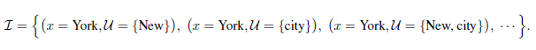

请注意，$\mathcal{I}$只是一个（没有唯一的事实 without unique ground truth）虚拟概念，无论$\mathcal{I}$如何实例化，我们的分析都将成立。

给定目标集合tokens $\mathcal{T}$和非目标集合tokens $\mathcal{N} = \textbf{x} \backslash \mathcal{T}$，BERT和XLNet都最大化$log \  p(\mathcal{T} | \mathcal{N})$，但公式不同：

其中 $\mathcal{T}_{<x}$ 表示在 $\mathcal{T}$ 中并且因式分解顺序在 $x$ 之前的 tokens。这两个目标都包含对数$log \  p(x | \mathcal{V}_x)$形式的多个损失项。直观地，如果存在目标-上下文对$(x, \mathcal{U}) \in \mathcal{I}$使得$\mathcal{U} \subseteq \mathcal{V}_x$，则损失项$log \  p(x | \mathcal{V}_x)$为$x$和$\mathcal{U}$之间的依赖关系提供训练信号。为方便起见，如果$\mathcal{U} \subseteq \mathcal{V}_x$，则目标-上下文对$(x, \mathcal{U}) \in \mathcal{I}$被模型（的目标）覆盖。

根据定义，我们考虑两种情况：
+ 如果$\mathcal{U} \subseteq \mathcal{N}$，则依赖项$(x, \mathcal{U})$由BERT和XLNet覆盖。
+ 如果$\mathcal{U} \subseteq \mathcal{N} \cup \mathcal{T}_{<x}$ 并且 $\mathcal{U} \cap \mathcal{T}_{<x} \neq \emptyset$，则依赖关系只能由XLNet覆盖，而不能由BERT覆盖。结果，XLNet能够比BERT覆盖更多的依赖项。 换句话说，XLNet目标包含更有效的训练信号，从经验上讲，这会导致第3节中更好的表现。

### 2.6.2 与标准（自回归）语言模型对比

借用第2.6.1节中的示例和符号，标准的AR语言模型（如GPT [25]）只能覆盖依赖项（$x$ = York，$\mathcal{U}$ = {New}），而不能覆盖（$x$ = New，$\mathcal{U}$ = {York} ）。另一方面，XLNet可以可以覆盖所有的因式分解顺序的期望。AR语言建模的这种限制在实际应用中可能影响甚大。例如，考虑上下文是“Thom Yorke is the singer of Radiohead”和问题是“Who is the singer of Radiohead”的范围抽取式问答任务。“Thom Yorke”的表示形式不依赖于AR语言建模中的“Radiohead”，因此，不会在所有token表示形式上使用softmax的标准方法将它们选择为答案。更正式地说，考虑一个上下文目标对$(x, \mathcal{U})$：
+ 如果$\mathcal{U} \cap \mathcal{T}_{<x} \neq \emptyset$，其中$\mathcal{T}_{<x}$ 表示在原始序列中先于 $x$ 出现的tokens，AR语言模型将不能覆盖这种依赖关系。
+ 相比之下，xlnet能够在预期中覆盖所有依赖项。

类似ELMo[24]等方法以一种浅显的方式将前向和后向语言模型连接起来，这不足以对两个方向之间的深层交互进行建模。

### 2.6.3 缩小语言建模和预训练之间的差距

随着密度估计的深入[4，32，21]（注3：语言建模的问题本质上是文本数据的密度估计。），语言建模得到了迅速的发展[9，1，3]。 但是，由于缺乏双向上下文建模的能力（如2.6.2节中所述），语言建模和预训练之间存在差距。一些机器学习从业者甚至质疑语言建模直接改善下游任务的意义（注4： https://openreview.net/forum?id=HJePno0cYm ）。XLNet泛化了语言建模并缩小了这种差距。结果，它进一步“证明”了语言建模研究的意义。 此外，可以利用语言建模研究的快速发展进行预训练。 例如，我们将Transformer-XL集成到XLNet中，以演示最新语言建模进展的有用性。

## 3 实验
### 3.1 预训练和实现
### 3.2 RACE数据集
### 3.3 SQuAD数据集
### 3.4 文本分类
### 3.5 GLUE数据集
### 3.6 ClueWeb09-B数据集
### 3.7 消融研究

## 4 结论

XLNet是一种广义的AR预训练方法，它使用排序语言建模方法目标来结合AR和AE方法的优点。XLNet的神经网络结构被设计为与AR目标完美协作，包括集成Transformer-XL和精心设计的双流式注意机制。XLNet大大改进了各种任务结果，从而实现了最先进的结果。未来，我们设想将XLNet应用到更广泛的任务中，例如视觉和强化学习。

## 致谢

作者要感谢谢启哲和余亚当斯为该项目提供了有用的反馈，感谢程有龙和黄艳萍为改善我们的TPU实施提供了思路，感谢熊晨燕和戴竹云为厘清了文档排名任务的设置。ZY和RS得到了海军研究办公室N000141812861，美国国家科学基金会（NSF）IIS1763562，Nvidia奖学金和Siebel奖学金的支持。ZD和YY在IIS-1546329的资助下得到了NSF的部分支持，在美国科学技术部（DOE）的资助下，得到了ASCR ＃KJ040201的支持。

## 参考文献

XLNet 的参考文献见 [SemanticScholar](https://www.semanticscholar.org/paper/XLNet%3A-Generalized-Autoregressive-Pretraining-for-Yang-Dai/e0c6abdbdecf04ffac65c440da77fb9d66bb474c#citedPapers)。

## A 通过双流自注意力的目标感知表示（Target-Aware Representation via Two-Stream Self-Attention）

### A.1 标准语言模型参数设置失败的具体示例

在本节中，我们将提供一个具体示例来说明如何在排列目标下进行标准语言模型参数化，如2.3节中所述。具体来说，让我们考虑满足以下关系的两个不同的排列$\textbf{z}^{(1)}$和$\textbf{z}^{(2)}$：

然后，将这两个排列分别代入原始参数化（naive parameterization），我们得到了：

实际上，两个不同的目标位置$i$和$j$共享完全相同的模型预测。但是，两个位置的实际分布肯定不同。

### A.2 双流注意力

在这里，我们提供了使用Transformer-XL作为主干的模型的双流注意力的实现细节。

初始化表示：

缓存第 $m$ 层的内容表示从前一分段：$\widetilde h^{(m)}$

对于Transformer-XL层$m = 1，...，M$，连续使用相对位置编码（relative positional encoding）和位置感知前馈（position-wise feed-forward）注意力更新表示：

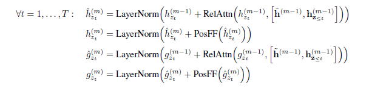

目标感知（Target-aware）预测分布：

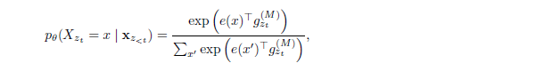

### A.3 超参数

#### A.3.1 预训练超参数

用于预训练xlnet的超参数如表7所示。

#### A.3.2 微调超参数

表8显示了用于在各种任务上微调XLNet的超参数。“逐层衰减（Layer-wise decay）”是指以自顶向下的方式按指数方式衰减各个层的学习速率。例如，假设第24层使用学习率$l$，并且逐层衰减率是$\alpha$，则第$m$层的学习率是$l \alpha^{24-m}$。

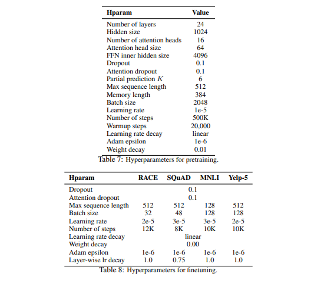

### A.4 可视化内存和排列

在本节中，我们将详细介绍所提出的排列语言模型目标，包括重用内存的机制（又称循环机制），如何使用注意力掩码（attention masks）来排列因式分解次序以及两个注意流的区别。如图3和4所示，在给定当前位置$z_t$的情况下，注意掩码由排列（或因式分解顺序）$\textbf{z}$决定，这样就可以只关注在排列中$z_t$之前出现的tokens； 即$z_i$的位置$i < t$。 此外，通过比较图3和图4，我们可以看到查询流和内容流如何通过注意掩码进行特定排列而不同地工作。主要区别在于查询流无法进行自注意力（self-attention），并且无法访问该位置的token，而内容流则执行正常的自注意力。

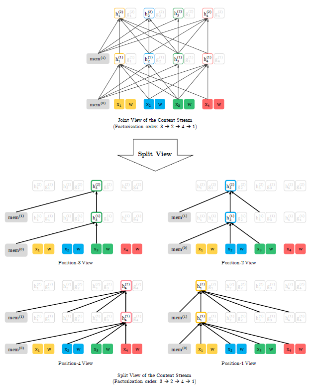
> 图3：如果序列的长度为4且因式分解顺序是[3, 2, 4, 1]，则根据本文提出的语言模型目标它内容流的详细的联合视角和分开时间图示。 请注意，如果我们忽略查询表示，则该图中的计算只是标准的字注意力，尽管带有特定的注意掩码。

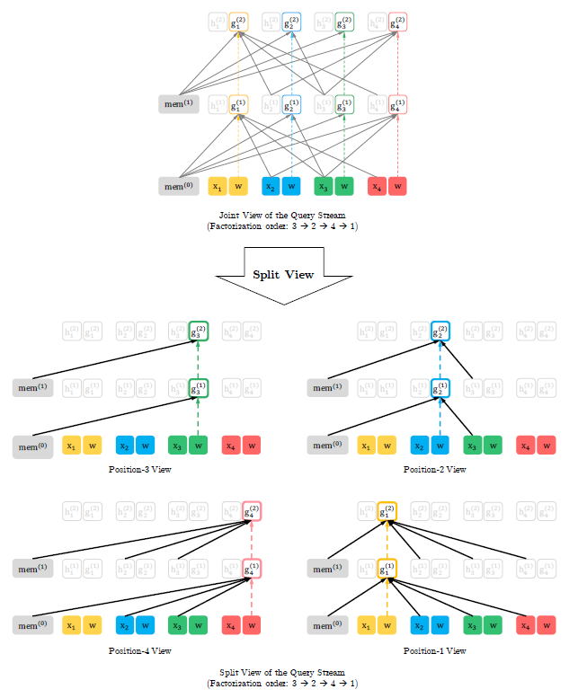
> 图4：如果序列的长度为4且因式分解顺序是[3, 2, 4, 1]，则根据本文提出的语言模型目标它查询流的详细的联合视角和分开时间图示。 短划线箭头表示查询流不能访问同一位置的token（内容），只能访问位置信息。
